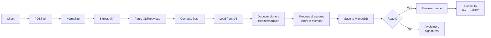
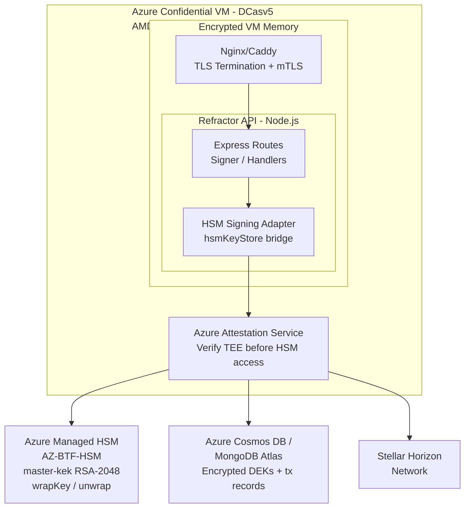
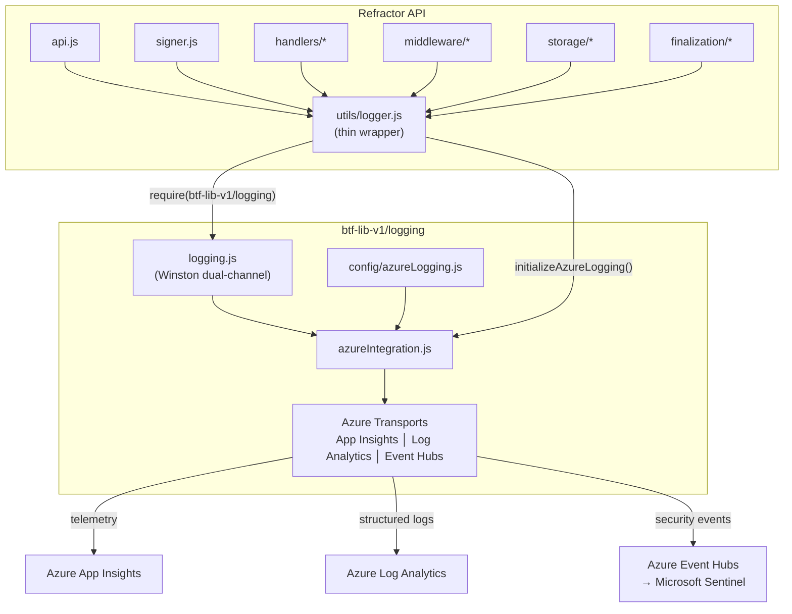
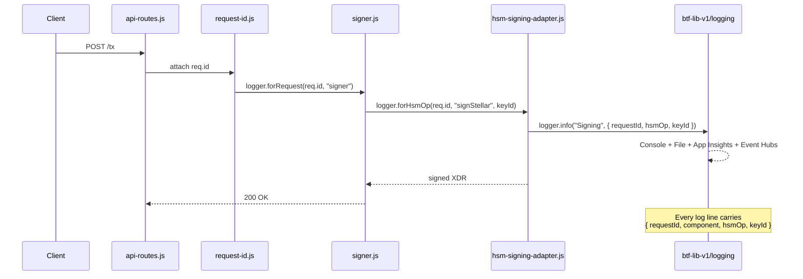
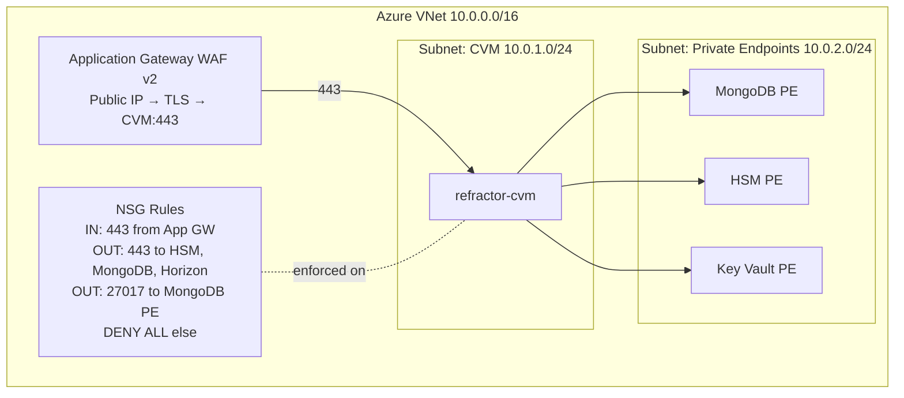
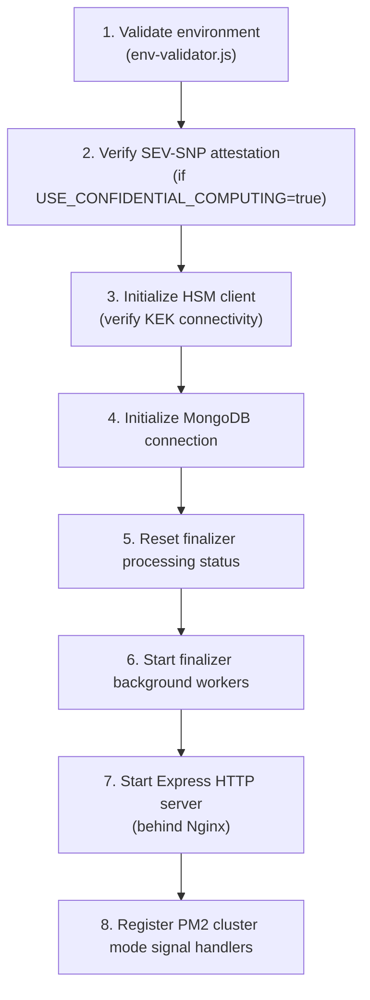

# Refractor API — Azure Confidential VM Optimization & Deployment Plan

> **Date:** March 4, 2026
> **Status:** Planning
> **Scope:** API optimization, HSM signing integration from `btf-lib-v1/secret/hsmKeyStore`, KEK-DEK envelope encryption, Azure Confidential VM deployment

---

## Table of Contents

1. [Codebase Analysis Summary](#1-codebase-analysis-summary)
2. [Architecture Overview](#2-architecture-overview)
3. [Optimization Plan](#3-optimization-plan)
4. [HSM Integration Plan](#4-hsm-integration-plan)
5. [Azure Confidential VM Deployment](#5-azure-confidential-vm-deployment)
6. [Implementation Phases](#6-implementation-phases)
7. [Environment Configuration](#7-environment-configuration)
8. [Security Considerations](#8-security-considerations)
9. [Operational Runbook](#9-operational-runbook)

---

## 1. Codebase Analysis Summary

### Current Architecture

| Component         | Technology                                                   | Notes                                                    |
| ----------------- | ------------------------------------------------------------ | -------------------------------------------------------- |
| **Runtime**       | Node.js + Express 5.1                                        | Async IIFE entry point, single-process                   |
| **Database**      | MongoDB via Mongoose 8.x                                     | Primary storage; Firestore/FS/in-memory alternatives     |
| **Queue**         | `fastq` via `EnhancedQueue`                                  | Adaptive concurrency, retry, metrics                     |
| **Blockchains**   | Stellar (primary), 1Money, Algorand, Ethereum/EVM (6 chains) | Handler-factory pattern; 1Money uses EVM-compatible keys |
| **Signing**       | In-memory `@stellar/stellar-sdk` `Keypair`                   | **Keys in plaintext memory**                             |
| **Auth**          | API-key header (`X-Admin-API-Key`), constant-time compare    | Admin routes only                                        |
| **Rate limiting** | `express-rate-limit` (100/s general, 50/s strict)            | Per-window, no distributed store                         |
| **Logging**       | Winston with component-scoped child loggers                  | Structured JSON                                          |
| **Security**      | Helmet CSP, CORS blacklist, payload limits                   | Good baseline                                            |

### Identified Issues

| Issue                                    | Severity     | Impact                                         |
| ---------------------------------------- | ------------ | ---------------------------------------------- |
| **Signing keys in plaintext memory**     | **CRITICAL** | Cold-boot/memory dump exposes all private keys |
| Single-process architecture              | HIGH         | No horizontal scaling, single point of failure |
| No TLS termination built-in              | HIGH         | Relies on external proxy                       |
| Rate limiter in-memory only              | MEDIUM       | Resets on restart, no cross-instance sharing   |
| No HSM/TEE integration                   | CRITICAL     | Keys unprotected at rest and in transit        |
| No attestation verification              | HIGH         | Cannot prove execution environment integrity   |
| Queue metrics not persisted              | LOW          | Lost on restart                                |
| No circuit breaker for Horizon/RPC calls | MEDIUM       | Cascade failures possible                      |

### Current Transaction Flow



### Key Integration Points for HSM

The signing path that must be modified:

1. **`business-logic/signer.js`** — `_verifyStellarSignature()`, `processSignature()`, `verifySignature()`
2. **`business-logic/finalization/tx-submitter.js`** — Transaction submission (needs HSM-signed payloads)
3. **`business-logic/finalization/horizon-handler.js`** — Stellar submission
4. **`business-logic/handlers/stellar-handler.js`** — Stellar transaction parsing
5. **`storage/storage-layer.js`** — Must also store encrypted key metadata

---

## 2. Architecture Overview

### Target Architecture on Azure Confidential VM



### Two-Tier Signing Model

| Tier                            | Module                                        | Use Case                         | Memory Exposure                         |
| ------------------------------- | --------------------------------------------- | -------------------------------- | --------------------------------------- |
| **Tier 1: Direct HSM**          | `azureCryptoService.signStellarTransaction()` | Treasury/custody keys (< 120K)   | **Zero** — key never leaves HSM         |
| **Tier 2: Envelope Encryption** | `hsmKeyStore.signStellarTransaction()`        | User wallets at scale (millions) | **Milliseconds** — protected by SEV-SNP |

The Confidential VM's AMD SEV-SNP hardware encryption means that even Tier 2's brief memory exposure is protected: the hypervisor, host OS, and co-tenant VMs cannot read the decrypted DEK.

---

## 3. Optimization Plan

### 3.1 Performance Optimizations

#### A. Connection Pooling & Keep-Alive

```javascript
// Current: maxPoolSize: 10
// Optimized for CVM workloads:
const mongooseOptions = {
  maxPoolSize: 25, // Scale with CVM vCPUs (DCasv5 = up to 96)
  minPoolSize: 5, // Pre-warm connections
  maxIdleTimeMS: 60000, // Longer idle (VMs are dedicated)
  serverSelectionTimeoutMS: 5000,
  socketTimeoutMS: 45000,
  compressors: ["zstd", "snappy"], // Wire compression
  retryWrites: true,
  retryReads: true,
  readPreference: "secondaryPreferred", // Read scaling
};
```

#### B. Enhanced Queue Tuning

```javascript
// Current defaults are conservative. For CVM with dedicated resources:
{
  concurrency: Math.min(os.cpus().length * 4, 100),  // CPU-aware
  maxConcurrency: 200,
  minConcurrency: 4,
  retryAttempts: 5,
  retryDelay: 500,                                     // Faster retry in dedicated env
  metricsInterval: 15000,
}
```

#### C. Azure Managed Redis Cache for HSM Key Metadata

Key metadata (NOT decrypted keys) can be cached in Azure Managed Redis to avoid repeated MongoDB lookups. Unlike an in-memory LRU cache, Redis provides a shared cache across all PM2 cluster workers and horizontally scaled CVM instances, with persistence across restarts.

```javascript
const Redis = require("ioredis");

// Connect to Azure Managed Redis via Private Endpoint (TLS required)
const redis = new Redis(process.env.REDIS_URL, {
  tls: { servername: new URL(process.env.REDIS_URL).hostname },
  maxRetriesPerRequest: 3,
  enableReadyCheck: true,
  lazyConnect: true,
});

const KEY_METADATA_PREFIX = "keymeta:";
const KEY_METADATA_TTL = 300; // 5 min TTL (seconds)

/**
 * Cache and retrieve HSM key metadata from Azure Managed Redis.
 * ONLY stores: keyId, publicKey, blockchain, status, kekName
 * NEVER stores: encryptedDek, decrypted material, seeds, private keys
 */
async function getCachedKeyMetadata(keyId) {
  const cached = await redis.get(`${KEY_METADATA_PREFIX}${keyId}`);
  if (cached) return JSON.parse(cached);

  // Cache miss — fetch from MongoDB, cache the safe subset
  const record = await db.collection("keys").findOne({ keyId });
  if (!record) return null;

  const metadata = {
    keyId: record.keyId,
    publicKey: record.publicKey,
    blockchain: record.blockchain,
    status: record.status,
    kekName: record.kekName,
  };
  await redis.set(
    `${KEY_METADATA_PREFIX}${keyId}`,
    JSON.stringify(metadata),
    "EX",
    KEY_METADATA_TTL,
  );
  return metadata;
}

async function invalidateKeyMetadata(keyId) {
  await redis.del(`${KEY_METADATA_PREFIX}${keyId}`);
}
```

> **Why Redis over in-memory LRU?**
>
> - **Shared state**: All PM2 workers and multiple CVM instances see the same cache — no cold-start penalty per process.
> - **Persistence**: Cache survives individual worker restarts and PM2 reloads.
> - **Eviction policies**: Azure Managed Redis supports `allkeys-lfu` eviction, matching LRU/LFU semantics at the infrastructure level.
> - **Already provisioned**: The same Redis instance used for [distributed rate limiting (§3.1 F)](#f-distributed-rate-limiting) can host key metadata, avoiding an additional dependency.
> - **Security**: Azure Managed Redis supports Private Endpoint + TLS + AAD auth, keeping cache traffic within the VNet.

#### D. Circuit Breaker for External Services

Add circuit breakers for Horizon, EVM RPC, and HSM calls:

```javascript
// New dependency: opossum or cockatiel
const CircuitBreaker = require("opossum");
const horizonBreaker = new CircuitBreaker(horizonCall, {
  timeout: 10000,
  errorThresholdPercentage: 50,
  resetTimeout: 30000,
  volumeThreshold: 5,
});
```

#### E. Cluster Mode with PM2

```javascript
// ecosystem.config.js for PM2 on CVM
module.exports = {
  apps: [
    {
      name: "refractor-api",
      script: "api.js",
      instances: "max", // One per vCPU
      exec_mode: "cluster",
      max_memory_restart: "1G",
      env_production: {
        NODE_ENV: "production",
        UV_THREADPOOL_SIZE: 16, // Increase for crypto ops
      },
    },
  ],
};
```

#### F. Distributed Rate Limiting

Replace in-memory rate limiter with Redis-backed for multi-instance:

```javascript
const RedisStore = require("rate-limit-redis");
const rateLimit = require("express-rate-limit");

const limiter = rateLimit({
  store: new RedisStore({ client: redisClient }),
  windowMs: 1000,
  max: 100,
});
```

### 3.2 Code Quality Optimizations

| Area           | Current                               | Proposed                                                |
| -------------- | ------------------------------------- | ------------------------------------------------------- |
| Error handling | Mix of `standardError` + raw throws   | Unified error boundary middleware                       |
| Validation     | Joi at middleware + Mongoose validate | Single Joi pass, skip Mongoose re-validation            |
| Logging        | Custom Winston per-app                | Standardize on `btf-lib-v1/logging` (see §3.2.A below)  |
| Tests          | Jest with mocks                       | Add integration tests for HSM signing path              |
| Health checks  | Basic DB + queue                      | Add HSM health, attestation status, key rotation alerts |

#### 3.2.A Standardized Logging — `btf-lib-v1/logging/logging.js`

**Problem:** Refractor's `utils/logger.js` creates its own Winston instance
independently from every other BTF platform service. Each platform has
distinct log formats, file paths, rotation policies, and no shared security
logger. This makes cross-service tracing, centralized Azure Monitor
ingestion, and compliance audit trails unnecessarily difficult.

**Solution:** Replace the per-app Winston setup with the centralized
`btf-lib-v1/logging/logging.js` module. This gives every BTF platform
(Refractor, Admin, Dashboard, Guardian, etc.) identical capabilities:

| Capability               | `btf-lib-v1/logging` provides                                     | Current Refractor `utils/logger.js`        |
| ------------------------ | ----------------------------------------------------------------- | ------------------------------------------ |
| Dual-channel logging     | `logger` (app) + `securityLogger` (syslog levels)                 | Single `logger` only — no security channel |
| Console formatting       | Chalk-colored `[LABEL] [TIMESTAMP] [LEVEL]: MSG`                  | Basic `colorize` printf                    |
| File rotation            | Configurable `maxsize` / `maxFiles` / `zippedArchive`             | Only when `LOG_FILE` env is set            |
| Safe serialization       | `safeStringify()` — circular ref → `[Circular Reference]`         | Raw `JSON.stringify` in meta               |
| Azure transports         | App Insights, Log Analytics, Event Hubs via `azureIntegration.js` | None                                       |
| Config hierarchy         | `process.env → config.get() → default`                            | `process.env` only                         |
| Security event streaming | Event Hubs → Microsoft Sentinel SIEM                              | Not available                              |

**Migration architecture:**



**Rewritten `utils/logger.js`:**

The rewrite preserves the existing API surface (`forComponent()`,
`forRequest()`, `child()`) so **no call-site changes** are required in
any of the ~20 files that import the logger.

```javascript
/**
 * BTF Standardized Logger — Refractor API
 *
 * Thin wrapper around btf-lib-v1/logging/logging.js that:
 *  1. Re-exports the centralized dual-channel loggers
 *  2. Adds forComponent() / forRequest() / child() convenience methods
 *  3. Initializes Azure transports (App Insights, Log Analytics, Event Hubs)
 *  4. Tags every log entry with { service: "refractor-api" }
 *
 * All existing call sites continue to work unchanged:
 *   const logger = require("../utils/logger").forComponent("signer");
 */
const {
  logger: btfLogger,
  securityLogger,
} = require("../../btf-lib-v1/logging/logging");
const {
  initializeAzureLogging,
} = require("../../btf-lib-v1/logging/azureIntegration");

// ── Service-level metadata ──────────────────────────────────────────
btfLogger.defaultMeta = {
  ...btfLogger.defaultMeta,
  service: "refractor-api",
  instance: process.env.NODE_APP_INSTANCE || "0",
};

securityLogger.defaultMeta = {
  ...securityLogger.defaultMeta,
  service: "refractor-api",
  instance: process.env.NODE_APP_INSTANCE || "0",
};

// ── Azure transports (enabled via env vars) ─────────────────────────
// Set AZURE_LOGGING_ENABLED=true + per-transport flags to activate
const azureTransports = initializeAzureLogging(
  { logger: btfLogger, securityLogger },
  {
    appInsights: { cloudRole: "refractor-api" },
    logAnalytics: { logType: "RefractorAppLogs" },
    eventHubs: { eventType: "RefractorSecurityEvent" },
  },
);

// ── Convenience methods (backward-compatible API surface) ───────────

/**
 * Create a component-scoped logger.
 * Usage: require("../utils/logger").forComponent("signer")
 */
btfLogger.forComponent = function (component) {
  return this.child({ component });
};

/**
 * Create a request-scoped logger with correlation ID.
 * Usage: logger.forRequest(req.id, "api-routes")
 */
btfLogger.forRequest = function (requestId, component) {
  const meta = { requestId };
  if (component) meta.component = component;
  return this.child(meta);
};

/**
 * Create a child logger with HSM correlation context.
 * Used by the HSM signing adapter for end-to-end operation tracing.
 *
 * Usage: logger.forHsmOp(requestId, "signStellar", keyId)
 */
btfLogger.forHsmOp = function (requestId, operation, keyId) {
  return this.child({
    requestId,
    hsmOp: operation,
    keyId,
    component: "hsm-signing",
  });
};

// ── Exports ─────────────────────────────────────────────────────────
// Default export = standard app logger (keeps all existing call sites working)
module.exports = btfLogger;

// Named exports for modules that need the security channel
module.exports.logger = btfLogger;
module.exports.securityLogger = securityLogger;
module.exports.azureTransports = azureTransports;
```

**Security logger usage (new capability):**

HSM operations, signing events, and key lifecycle actions should use the
security logger for compliance and SIEM integration:

```javascript
const { securityLogger } = require("../utils/logger");

// HSM key creation — syslog "notice" level
securityLogger.notice("HSM key created", {
  keyId,
  blockchain,
  userId,
  tier: "envelope",
});

// Signing operation — syslog "info" level
securityLogger.info("Transaction signed via HSM", {
  requestId,
  keyId,
  blockchain,
  txHash,
});

// Failed attestation — syslog "alert" level
securityLogger.alert("CVM attestation verification failed", {
  requestId,
  attestationError: err.message,
});

// Unauthorized signing attempt — syslog "crit" level
securityLogger.crit("Unauthorized HSM signing attempt blocked", {
  requestId,
  sourceIp,
  keyId,
  reason: "origin_not_verified",
});
```

**HSM correlation ID flow:**

Every HSM signing request gets a correlation context that propagates
through the full request lifecycle:



**Azure transport environment variables:**

| Variable                             | Purpose                                | Example                  |
| ------------------------------------ | -------------------------------------- | ------------------------ |
| `AZURE_LOGGING_ENABLED`              | Global on/off for all Azure transports | `true`                   |
| `AZURE_APPINSIGHTS_ENABLED`          | Enable App Insights telemetry          | `true`                   |
| `AZURE_APPINSIGHTS_CONNECTIONSTRING` | App Insights connection string         | `InstrumentationKey=...` |
| `AZURE_LOGANALYTICS_ENABLED`         | Enable Log Analytics structured logs   | `true`                   |
| `AZURE_LOGANALYTICS_WORKSPACEID`     | Log Analytics workspace ID             | `xxxxxxxx-xxxx-...`      |
| `AZURE_LOGANALYTICS_SHAREDKEY`       | Log Analytics shared key               | `base64...`              |
| `AZURE_EVENTHUBS_ENABLED`            | Enable Event Hubs security streaming   | `true`                   |
| `AZURE_EVENTHUBS_CONNECTIONSTRING`   | Event Hubs connection string           | `Endpoint=sb://...`      |
| `LOGGING_LEVEL`                      | Override log level                     | `debug`                  |
| `LOGGING_ZIPPEDARCHIVE`              | Compress rotated logs                  | `true`                   |

**Files requiring changes (zero call-site changes elsewhere):**

| File              | Change                                                          |
| ----------------- | --------------------------------------------------------------- |
| `utils/logger.js` | Rewrite to wrap `btf-lib-v1/logging/logging.js` (shown above)   |
| `package.json`    | Add `chalk` dependency (already a transitive dep of btf-lib-v1) |
| `app.config.json` | Add `logging.*` config block with rotation + level defaults     |
| `.env.production` | Add `AZURE_LOGGING_ENABLED` + transport connection strings      |

All ~20 existing import sites (`require("../utils/logger").forComponent(...)`)
continue to work unchanged because the wrapper preserves the same API surface.

---

## 4. HSM Integration Plan

### 4.1 New Module: `business-logic/hsm-signing-adapter.js`

Bridge between Refractor's `Signer` class and `btf-lib-v1/secret/hsmKeyStore`:

```javascript
/**
 * HSM Signing Adapter
 *
 * Provides HSM-backed signing for the Refractor API by integrating
 * with btf-lib-v1's hsmKeyStore (KEK-DEK envelope encryption) and
 * azureCryptoService (direct HSM signing).
 *
 * Key design decisions:
 * - Tier 1 (direct HSM): Used for finalization signing (server-side)
 * - Tier 2 (envelope): Used for managed wallet signing
 * - Both tiers protected by Azure CVM memory encryption
 */

const hsmKeyStore = require("../../btf-lib-v1/secret/hsmKeyStore");
const {
  WrappedKeyContext,
} = require("../../btf-lib-v1/secret/envelopeEncryption");
const azureCryptoService = require("../../btf-lib-v1/secret/azureCryptoService");

class HsmSigningAdapter {
  constructor(options = {}) {
    this.tier = options.tier || "envelope"; // 'direct' or 'envelope'
    this.dbName = options.dbName || "refractor";
  }

  /**
   * Sign a Stellar transaction using HSM-protected keys
   * @param {string} keyId - Key identifier in the HSM key store
   * @param {Transaction} transaction - Stellar SDK Transaction object
   * @returns {Promise<string>} Signed XDR
   */
  async signStellarTransaction(keyId, transaction) {
    if (this.tier === "direct") {
      // Tier 1: Key never leaves HSM
      return azureCryptoService.signStellarTransaction({
        keyName: keyId,
        transaction,
      });
    }

    // Tier 2: Envelope encryption (KEK-DEK)
    return hsmKeyStore.signStellarTransaction({
      keyId,
      dbName: this.dbName,
      transaction,
    });
  }

  /**
   * Sign an EVM transaction using HSM-protected keys.
   * Also used for 1Money Network — 1Money uses the same secp256k1 keys,
   * 0x addresses, and ECDSA v/r/s signatures as Ethereum.
   */
  async signEvmTransaction(keyId, transaction) {
    return hsmKeyStore.signEthereumTransaction({
      keyId,
      dbName: this.dbName,
      transaction,
    });
  }

  /**
   * Sign a 1Money payment message using HSM-protected secp256k1 keys.
   * Under the hood this is identical to signEvmTransaction — 1Money uses
   * Ethereum's elliptic curve cryptography (secp256k1/ECDSA).
   *
   * Flow: unwrap secp256k1 private key → RLP encode payment fields →
   *       keccak256 hash → ECDSA sign → return { v, r, s }
   *
   * @param {string} keyId - Key identifier in the HSM key store
   * @param {Object} transaction - 1Money payment message
   * @returns {Promise<Object>} { v, r, s, hash, from }
   */
  async signOneMoneyTransaction(keyId, transaction) {
    // 1Money keys are Ethereum keys — reuse the same HSM signing path
    return hsmKeyStore.signEthereumTransaction({
      keyId,
      dbName: this.dbName,
      blockchain: "onemoney",
      transaction,
    });
  }

  /**
   * Sign an Algorand transaction using HSM-protected ed25519 keys.
   *
   * Flow: unwrap 32-byte seed → reconstruct 64-byte key (seed‖pubkey)
   *       → algosdk.signTransaction() → secureZero() immediately
   *
   * @param {string} keyId - Key identifier in the HSM key store
   * @param {Object} transaction - Algorand transaction (msgpack or SDK object)
   * @returns {Promise<Object>} { signedTxn: Uint8Array, txId: string }
   */
  async signAlgorandTransaction(keyId, transaction) {
    return hsmKeyStore.signAlgorandTransaction({
      keyId,
      dbName: this.dbName,
      transaction,
    });
  }

  /**
   * Sign arbitrary data with an Algorand ed25519 key via HSM.
   * Uses tweetnacl.sign.detached() — same ed25519 primitive as algosdk.
   *
   * @param {string} keyId - Key identifier
   * @param {Buffer|string|Uint8Array} data - Data to sign
   * @returns {Promise<Object>} { signature: string (base64), address: string }
   */
  async signAlgorandData(keyId, data) {
    return hsmKeyStore.signAlgorandData({
      keyId,
      dbName: this.dbName,
      data,
    });
  }

  /**
   * Create a new HSM-managed key for a blockchain
   */
  async createKey(blockchain, options) {
    const createFn = {
      stellar: hsmKeyStore.createStellarKey,
      ethereum: hsmKeyStore.createEthereumKey,
      onemoney: hsmKeyStore.createEthereumKey, // 1Money uses EVM-compatible secp256k1 keys
      solana: hsmKeyStore.createSolanaKey,
      algorand: hsmKeyStore.createAlgorandKey,
    }[blockchain];

    if (!createFn)
      throw new Error(`HSM key creation not supported for ${blockchain}`);

    return createFn({
      ...options,
      dbName: this.dbName,
    });
  }

  /**
   * Health check for HSM connectivity
   */
  async healthCheck() {
    return hsmKeyStore.healthCheck();
  }
}

module.exports = HsmSigningAdapter;
```

### 4.2 Integration Points in Existing Code

#### A. `signer.js` — Add HSM-Aware Signature Verification

Current flow verifies signatures in memory using `Keypair.fromPublicKey(key).verify()`. This doesn't change — signature **verification** is a public-key operation and doesn't need HSM. However, **server-side signing** (when Refractor itself is a signer) needs HSM:

```javascript
// New method in Signer class:
async signWithHsm(keyId, options = {}) {
  const adapter = require('./hsm-signing-adapter');
  const hsm = new adapter({ tier: options.tier || 'envelope' });

  if (this.blockchain === 'stellar') {
    const signedXdr = await hsm.signStellarTransaction(keyId, this.tx);
    // Re-parse to extract the new signature
    const signedTx = TransactionBuilder.fromXDR(signedXdr, this.txInfo.network);
    // Process the new signature through existing flow
    const newSigs = signedTx.signatures.filter(sig =>
      !this.txInfo.signatures.some(existing =>
        existing.signature === sig.signature().toString('base64')
      )
    );
    for (const sig of newSigs) {
      this.processSignature(sig);
    }
  } else if (this.blockchain === 'algorand') {
    // Algorand: HSM unwraps the 32-byte ed25519 seed, reconstructs the
    // 64-byte key (seed‖pubkey), calls algosdk.signTransaction(), zeros memory
    const result = await hsm.signAlgorandTransaction(keyId, this.tx);
    // result = { signedTxn: Uint8Array, txId: string, address: string }
    // Feed the signature back through the Algorand processing path
    if (result.data && result.data.signedTxn) {
      const sigObj = {
        type: 'single',
        signature: Buffer.from(result.data.signedTxn).toString('base64'),
        from: result.data.address,
      };
      this.processSignature(sigObj);
    }
  } else if (isEvmBlockchain(this.blockchain)) {
    // EVM and 1Money share the same secp256k1 signing path.
    // isEvmBlockchain('onemoney') returns true — 1Money uses identical
    // key format, address derivation, and ECDSA signature scheme.
    await hsm.signEvmTransaction(keyId, this.tx);
  }
}
```

#### B. `tx-submitter.js` — HSM-Signed Submission

When the API itself needs to co-sign (e.g., as a multisig participant):

```javascript
// Before submission, check if server-side HSM signing is required
async function maybeHsmSign(txInfo) {
  if (!config.hsmSigningEnabled) return txInfo;

  const serverKeyId = config.hsmServerKeyIds[txInfo.blockchain];
  if (!serverKeyId) return txInfo;

  const adapter = new HsmSigningAdapter({ tier: config.hsmTier });

  // Route to the correct signing method per blockchain
  switch (txInfo.blockchain) {
    case "stellar":
      return adapter.signStellarTransaction(serverKeyId, txInfo.transaction);
    case "algorand":
      return adapter.signAlgorandTransaction(serverKeyId, txInfo.transaction);
    case "onemoney":
      // 1Money uses EVM-compatible secp256k1 keys — same signing path as Ethereum
      return adapter.signOneMoneyTransaction(serverKeyId, txInfo.transaction);
    default:
      if (isEvmBlockchain(txInfo.blockchain)) {
        return adapter.signEvmTransaction(serverKeyId, txInfo.transaction);
      }
      return txInfo;
  }
}
```

#### C. New API Endpoints for Key Management

```
POST   /keys                    — Create HSM-managed key
GET    /keys/:keyId             — Get key metadata (public key, status)
POST   /keys/:keyId/sign        — Sign with HSM-managed key
POST   /keys/:keyId/rotate      — Rotate key
DELETE /keys/:keyId              — Disable key
GET    /keys/health              — HSM health check
```

### 4.3 KEK-DEK Flow Within Refractor

#### Key Creation

```mermaid
sequenceDiagram
    participant Client
    participant API as Refractor API
    participant HSM as hsmKeyStore
    participant HW as Azure HSM
    participant DB as MongoDB

    Note over Client,DB: Stellar Key Creation
    Client->>API: POST /keys { blockchain: stellar }
    API->>HSM: createStellarKey()
    HSM->>HSM: Keypair.random() → 32-byte ed25519 seed
    HSM->>HW: wrapKey(RSA-OAEP, seed)
    HW-->>HSM: encryptedDek
    HSM->>HSM: secureZero(seed)
    HSM->>DB: Store { keyId, publicKey, encryptedDek, kekName }
    HSM-->>API: { keyId, publicKey }
    API-->>Client: { keyId, publicKey }

    Note over Client,DB: Algorand Key Creation (same ed25519 curve)
    Client->>API: POST /keys { blockchain: algorand }
    API->>HSM: createAlgorandKey()
    HSM->>HSM: algosdk.generateAccount() → { addr, sk[64] }
    HSM->>HSM: seed = sk[0..31] (32-byte ed25519 seed)
    HSM->>HW: wrapKey(RSA-OAEP, seed)
    HW-->>HSM: encryptedDek
    HSM->>HSM: secureZero(seed); sk.fill(0)
    HSM->>DB: Store { keyId, address, publicKey(hex), encryptedDek, kekName }
    HSM-->>API: { keyId, address, publicKey }
    API-->>Client: { keyId, address, publicKey }

    Note over Client,DB: 1Money Key Creation (same secp256k1 as Ethereum)
    Client->>API: POST /keys { blockchain: onemoney }
    API->>HSM: createEthereumKey({ blockchain: 'onemoney' })
    HSM->>HSM: ethers.Wallet.createRandom() → secp256k1 keypair
    HSM->>HSM: privateKey = 32-byte secp256k1 secret
    HSM->>HW: wrapKey(RSA-OAEP, privateKey)
    HW-->>HSM: encryptedDek
    HSM->>HSM: secureZero(privateKey)
    HSM->>DB: Store { keyId, address(0x), publicKey(hex), encryptedDek, kekName, blockchain: 'onemoney' }
    HSM-->>API: { keyId, address }
    API-->>Client: { keyId, address }
```

#### Transaction Signing

```mermaid
sequenceDiagram
    participant Client
    participant API as Refractor API
    participant DB as MongoDB
    participant HW as Azure HSM
    participant Sign as Signing Logic

    Note over Client,Sign: Stellar Transaction Signing
    Client->>API: POST /keys/:keyId/sign { transaction: XDR }
    API->>DB: Fetch encryptedDek
    DB-->>API: encryptedDek
    API->>HW: unwrapKey(RSA-OAEP, encryptedDek)
    HW-->>API: 32-byte seed
    API->>Sign: Keypair.fromRawEd25519Seed(seed)
    Sign->>Sign: transaction.sign(keypair)
    Sign->>Sign: secureZero(seed) ← IMMEDIATE
    Sign-->>API: Signed XDR
    API-->>Client: Signed XDR

    Note over Client,Sign: Algorand ed25519 Signing
    Client->>API: POST /keys/:keyId/sign { transaction: msgpack/b64 }
    API->>DB: Fetch encryptedDek + publicKey(hex)
    DB-->>API: encryptedDek, publicKey
    API->>HW: unwrapKey(RSA-OAEP, encryptedDek)
    HW-->>API: 32-byte seed
    API->>Sign: fullKey = Uint8Array(64) [seed‖pubkey]
    Sign->>Sign: algosdk.signTransaction(tx, fullKey)
    Sign->>Sign: secureZero(seed); fullKey.fill(0) ← IMMEDIATE
    Sign-->>API: { signedTxn, txId }
    API-->>Client: { signedTxn, txId }

    Note over Client,Sign: 1Money Signing (secp256k1 — same as Ethereum)
    Client->>API: POST /keys/:keyId/sign { transaction: JSON payment }
    API->>DB: Fetch encryptedDek
    DB-->>API: encryptedDek
    API->>HW: unwrapKey(RSA-OAEP, encryptedDek)
    HW-->>API: 32-byte secp256k1 private key
    API->>Sign: RLP encode payment fields → keccak256 hash
    Sign->>Sign: ECDSA sign(hash, privateKey) → { v, r, s }
    Sign->>Sign: secureZero(privateKey) ← IMMEDIATE
    Sign-->>API: { v, r, s, hash, from }
    API-->>Client: Signed 1Money payment

    Note over API,Sign: ⚡ Steps 3-6 protected by AMD SEV-SNP memory encryption<br/>⚡ DEK in plaintext for ~2-5ms only
```

---

## 5. Azure Confidential VM Deployment

### 5.1 VM Selection

| Spec          | Recommendation                        | Rationale                             |
| ------------- | ------------------------------------- | ------------------------------------- |
| **VM Series** | `DCasv5`                              | AMD SEV-SNP, Confidential Compute     |
| **Size**      | `Standard_DC4as_v5` (4 vCPU, 16 GB)   | Adequate for API + queue workload     |
| **Scale-up**  | `Standard_DC8as_v5` (8 vCPU, 32 GB)   | If > 1000 tx/min sustained            |
| **OS**        | Ubuntu 22.04 CVM (Confidential)       | First-class CVM support               |
| **Disk**      | Confidential OS disk encryption (VMK) | Full disk encryption via platform key |
| **Region**    | Match HSM region (minimize latency)   | Same region as `AZ-BTF-HSM`           |

### 5.2 Confidential Computing Features

```bash
# Verify SEV-SNP is active inside the VM
sudo dmesg | grep -i sev
# Expected: "AMD Memory Encryption Features active: SEV SEV-ES SEV-SNP"

# Verify attestation
curl -s http://169.254.169.254/metadata/attested/document?api-version=2021-02-01 \
  -H "Metadata: true" | jq .
```

### 5.3 Infrastructure as Code (Bicep)

```bicep
// confidential-vm.bicep
resource confidentialVm 'Microsoft.Compute/virtualMachines@2024-03-01' = {
  name: 'refractor-api-cvm'
  location: resourceGroup().location
  properties: {
    hardwareProfile: {
      vmSize: 'Standard_DC4as_v5'
    }
    securityProfile: {
      securityType: 'ConfidentialVM'
      uefiSettings: {
        secureBootEnabled: true
        vTpmEnabled: true
      }
    }
    osProfile: {
      computerName: 'refractor-cvm'
      adminUsername: 'btfadmin'
      linuxConfiguration: {
        disablePasswordAuthentication: true
        ssh: { publicKeys: [{ path: '/home/btfadmin/.ssh/authorized_keys', keyData: sshPublicKey }] }
      }
    }
    storageProfile: {
      osDisk: {
        createOption: 'FromImage'
        managedDisk: {
          securityProfile: {
            securityEncryptionType: 'VMGuestStateOnly' // or 'DiskWithVMGuestState'
          }
        }
      }
      imageReference: {
        publisher: 'Canonical'
        offer: '0001-com-ubuntu-confidential-vm-jammy'
        sku: '22_04-lts-cvm'
        version: 'latest'
      }
    }
    networkProfile: {
      networkInterfaces: [{ id: nic.id }]
    }
  }
  identity: {
    type: 'SystemAssigned'  // Used for HSM access via Managed Identity
  }
}

// Grant the VM's managed identity access to the HSM
resource hsmRoleAssignment 'Microsoft.Authorization/roleAssignments@2022-04-01' = {
  name: guid(confidentialVm.id, 'ManagedHSMCryptoUser')
  scope: managedHsm
  properties: {
    roleDefinitionId: 'Managed HSM Crypto User'
    principalId: confidentialVm.identity.principalId
    principalType: 'ServicePrincipal'
  }
}
```

### 5.4 Attestation-Gated HSM Access

Before the API can unwrap DEKs, it must prove it's running inside a genuine
CVM. In non-production environments (development, staging, test) the
attestation check can be bypassed via the `REQUIRE_CVM_ATTESTATION`
environment variable so developers can run the full stack locally or on
standard VMs without hardware TEE support.

| Variable                  | Values                                                     | Default                 | Behavior                                                                                                                                                                            |
| ------------------------- | ---------------------------------------------------------- | ----------------------- | ----------------------------------------------------------------------------------------------------------------------------------------------------------------------------------- |
| `REQUIRE_CVM_ATTESTATION` | `true` / `false`                                           | Derived from `NODE_ENV` | When `true`, the gateway **must** run inside a CVM and pass SEV-SNP attestation before any HSM DEK unwrap is allowed. When `false`, attestation is skipped and a warning is logged. |
| `NODE_ENV`                | `production` / `prod` / `development` / `staging` / `test` | —                       | If `REQUIRE_CVM_ATTESTATION` is not explicitly set, it defaults to `true` only when `NODE_ENV` is `production` or `prod`. All other values (including unset) default to `false`.    |

```javascript
// New module: utils/attestation.js
const { AttestationClient } = require("@azure/attestation");
const { DefaultAzureCredential } = require("@azure/identity");
const logger = require("./logger").forComponent("attestation");
const { securityLogger } = require("./logger");

/**
 * Determine whether CVM attestation is required.
 *
 * Priority:
 *  1. Explicit env var  REQUIRE_CVM_ATTESTATION=true|false
 *  2. Inferred from NODE_ENV — only "production" and "prod" require it
 *
 * @returns {boolean}
 */
function isCvmAttestationRequired() {
  const explicit = process.env.REQUIRE_CVM_ATTESTATION;
  if (explicit !== undefined) {
    return explicit === "true";
  }
  const env = (process.env.NODE_ENV || "").toLowerCase();
  return env === "production" || env === "prod";
}

/**
 * Verify the gateway is running inside a genuine Azure Confidential VM
 * by performing SEV-SNP attestation. In non-production environments the
 * check is bypassed unless REQUIRE_CVM_ATTESTATION=true is set.
 *
 * @returns {Promise<string|null>} Attestation JWT token, or null when bypassed
 * @throws {Error} If attestation is required but fails
 */
async function verifyTeeAndGetToken() {
  // ── Check whether attestation is required ──────────────────────────
  if (!isCvmAttestationRequired()) {
    const env = process.env.NODE_ENV || "development";
    logger.warn(
      `CVM attestation bypassed — REQUIRE_CVM_ATTESTATION is not enabled (NODE_ENV=${env}). ` +
        "HSM operations will proceed without TEE verification.",
    );
    securityLogger.warning("CVM attestation bypassed", {
      nodeEnv: env,
      requireCvmAttestation: process.env.REQUIRE_CVM_ATTESTATION ?? "unset",
      reason: "non-production environment or explicitly disabled",
    });
    return null; // No token — callers treat null as "attestation not enforced"
  }

  // ── Production: full SEV-SNP attestation ───────────────────────────
  logger.info("Performing CVM SEV-SNP attestation...");

  const client = new AttestationClient(
    process.env.AZURE_ATTESTATION_URL, // e.g., https://shared.eus.attest.azure.net
    new DefaultAzureCredential(),
  );

  // Get SNP report from hardware
  const snpReport = await getSnpReport(); // Read from /dev/sev-guest

  // Attest with Azure
  const result = await client.attestSevSnpVm({
    report: snpReport,
    runtimeData: {
      /* app version, config hash */
    },
  });

  securityLogger.notice("CVM attestation succeeded", {
    attestationUrl: process.env.AZURE_ATTESTATION_URL,
    tokenExpiry: result.token?.exp,
  });

  return result.token; // JWT proving TEE integrity
}

module.exports = { verifyTeeAndGetToken, isCvmAttestationRequired };
```

### 5.5 Network Security



### 5.6 Deployment Pipeline

```yaml
# .github/workflows/deploy-cvm.yml
name: Deploy to Azure Confidential VM

on:
  push:
    branches: [main]
    paths: ["api/**"]

jobs:
  test:
    runs-on: ubuntu-latest
    steps:
      - uses: actions/checkout@v4
      - run: cd api && npm ci && npm test

  deploy:
    needs: test
    runs-on: ubuntu-latest
    environment: production
    steps:
      - uses: actions/checkout@v4

      - name: Azure Login
        uses: azure/login@v2
        with:
          creds: ${{ secrets.AZURE_CREDENTIALS }}

      - name: Deploy to CVM
        run: |
          az vm run-command invoke \
            --resource-group refractor-prod \
            --name refractor-api-cvm \
            --command-id RunShellScript \
            --scripts "
              cd /opt/refractor/api
              git pull origin main
              npm ci --production
              pm2 reload ecosystem.config.js --env production
            "

      - name: Verify Health
        run: |
          sleep 10
          curl -f https://api.refractor.example.com/monitoring/health
```

---

## 6. Implementation Phases

### Phase 1: Foundation (Week 1-2)

| Task                                                       | Priority | Effort  |
| ---------------------------------------------------------- | -------- | ------- |
| Create `hsm-signing-adapter.js` bridge module              | P0       | 2 days  |
| Add `btf-lib-v1` as dependency (npm link or git submodule) | P0       | 0.5 day |
| Create `utils/attestation.js` for CVM verification         | P1       | 1 day   |
| Add HSM env vars to `env-validator.js`                     | P1       | 0.5 day |
| Extend `app.config.js` with HSM configuration section      | P1       | 0.5 day |
| Unit tests for HSM adapter (mocked)                        | P1       | 1 day   |
| Set up `ecosystem.config.js` for PM2 cluster mode          | P1       | 0.5 day |

### Phase 2: Integration (Week 3-4)

| Task                                                   | Priority | Effort  |
| ------------------------------------------------------ | -------- | ------- |
| Add `signWithHsm()` method to `Signer` class           | P0       | 2 days  |
| Create key management API routes (`/keys/*`)           | P0       | 2 days  |
| Extend `monitoring-routes.js` with HSM health endpoint | P1       | 0.5 day |
| Add HSM health to `/monitoring/health` composite check | P1       | 0.5 day |
| Integrate keyMetadata LRU cache                        | P1       | 1 day   |
| Add circuit breakers for HSM + Horizon calls           | P1       | 1 day   |
| Integration tests against HSM (dev environment)        | P0       | 2 days  |

### Phase 3: CVM Deployment (Week 5-6)

| Task                                      | Priority | Effort  |
| ----------------------------------------- | -------- | ------- |
| Provision DCasv5 VM via Bicep/Terraform   | P0       | 1 day   |
| Configure VNet, NSG, Private Endpoints    | P0       | 1 day   |
| Set up Application Gateway (WAF v2)       | P1       | 1 day   |
| Install Node.js, PM2, Nginx on CVM        | P0       | 0.5 day |
| Configure Managed Identity → HSM RBAC     | P0       | 0.5 day |
| Deploy application and verify attestation | P0       | 1 day   |
| Load testing (target: 500 tx/s)           | P1       | 1 day   |
| Set up Azure Monitor + alerts             | P1       | 1 day   |
| CI/CD pipeline (GitHub Actions)           | P1       | 1 day   |
| Runbook documentation                     | P2       | 1 day   |

### Phase 4: Hardening (Week 7-8)

| Task                                          | Priority | Effort |
| --------------------------------------------- | -------- | ------ |
| Enable attestation-gated HSM access           | P1       | 2 days |
| Add distributed rate limiting (Redis)         | P2       | 1 day  |
| MongoDB connection string rotation automation | P2       | 1 day  |
| KEK rotation procedure testing                | P1       | 1 day  |
| Penetration testing / security audit          | P0       | 3 days |
| Disaster recovery drill                       | P1       | 1 day  |

---

## 7. Environment Configuration

### Production `.env` on CVM

```bash
# ── Core Application ──
NODE_ENV=production
MODE=production
PORT=3000
MAX_PAYLOAD_SIZE=1mb
LOG_LEVEL=info
LOG_FILE=/var/log/refractor/api.log

# ── Storage ──
STORAGE_TYPE=mongoose
MONGODB_URL=mongodb+srv://refractor:<password>@cluster.mongodb.net/refractor?retryWrites=true&w=majority

# ── Admin ──
ADMIN_API_KEY=<generated-256-bit-key>

# ── Azure Identity (prefer Managed Identity in prod) ──
# When using Managed Identity, these are NOT needed:
# AZURE_TENANT_ID=...
# AZURE_CLIENT_ID=...
# AZURE_CLIENT_SECRET=...

# ── HSM Configuration ──
AZURE_MANAGED_HSM_URL=https://az-btf-hsm.managedhsm.azure.net/
HSM_MASTER_KEK_NAME=master-kek
HSM_KEK_VERSION=v1
HSM_WRAP_ALGORITHM=RSA-OAEP
ENVELOPE_ENCRYPTION_ENABLED=true
HSM_MAX_UNWRAP_DURATION_MS=5000

# ── HSM Signing Tier ──
HSM_SIGNING_ENABLED=true
HSM_SIGNING_TIER=envelope           # 'envelope' (hsmKeyStore) or 'direct' (azureCryptoService)
HSM_SERVER_KEY_STELLAR=<keyId>      # Server's own signing key ID
HSM_SERVER_KEY_ALGORAND=<keyId>     # Server's Algorand signing key ID
HSM_SERVER_KEY_ONEMONEY=<keyId>     # Server's 1Money signing key ID (same secp256k1 format as ETH)

# ── Confidential Computing ──
USE_CONFIDENTIAL_COMPUTING=true
AZURE_ATTESTATION_URL=https://shared.eus.attest.azure.net

# ── Stellar Networks ──
HORIZON_PUBLIC_URL=https://horizon.stellar.org
HORIZON_TESTNET_URL=https://horizon-testnet.stellar.org

# ── Rate Limiting (distributed) ──
REDIS_URL=redis://10.0.2.10:6379

# ── Queue Tuning ──
PARALLEL_TASKS=50
MAX_PARALLEL_TASKS=200
MIN_PARALLEL_TASKS=4
RETRY_ATTEMPTS=5
RETRY_DELAY=500
```

### New Config Section in `app.config.js`

```javascript
// HSM Configuration
hsm: {
  enabled: process.env.HSM_SIGNING_ENABLED === 'true',
  tier: process.env.HSM_SIGNING_TIER || 'envelope',
  hsmUrl: process.env.AZURE_MANAGED_HSM_URL,
  kekName: process.env.HSM_MASTER_KEK_NAME || 'master-kek',
  kekVersion: process.env.HSM_KEK_VERSION || 'v1',
  wrapAlgorithm: process.env.HSM_WRAP_ALGORITHM || 'RSA-OAEP',
  maxUnwrapDurationMs: parseInt(process.env.HSM_MAX_UNWRAP_DURATION_MS || '5000'),
  serverKeyIds: {
    stellar: process.env.HSM_SERVER_KEY_STELLAR,
    algorand: process.env.HSM_SERVER_KEY_ALGORAND,
    onemoney: process.env.HSM_SERVER_KEY_ONEMONEY,
    ethereum: process.env.HSM_SERVER_KEY_ETHEREUM,
  },
},

// Confidential Computing
confidentialComputing: {
  enabled: process.env.USE_CONFIDENTIAL_COMPUTING === 'true',
  attestationUrl: process.env.AZURE_ATTESTATION_URL,
},
```

---

## 8. Security Considerations

### 8.1 Threat Model

| Threat                              | Mitigation                                                     |
| ----------------------------------- | -------------------------------------------------------------- |
| **Memory dump/cold-boot attack**    | AMD SEV-SNP encrypts all VM memory; DEK in plaintext only ~ms  |
| **Hypervisor compromise**           | SEV-SNP: hypervisor cannot read guest memory                   |
| **Insider threat (Azure operator)** | Confidential VM + attestation proves code integrity            |
| **Key exfiltration from DB**        | DEKs stored encrypted with HSM KEK; useless without HSM access |
| **HSM compromise**                  | FIPS 140-3 Level 3; tamper-evident hardware                    |
| **API key theft**                   | Constant-time compare, rate limiting, audit logging            |
| **Network MITM**                    | TLS 1.3 everywhere, Private Endpoints for backend services     |
| **Supply chain attack**             | npm audit, lockfile integrity, signed deployments              |

### 8.2 Key Rotation Strategy

```mermaid
flowchart TD
    subgraph KEK["KEK Rotation — Quarterly"]
        K1[Create new KEK version in HSM] --> K2["Batch re-wrap all DEKs:<br/>unwrap(oldKEK) → wrap(newKEK)"]
        K2 --> K3[Update kekVersion in all key records]
        K3 --> K4[Retain old KEK for rollback — 90 days]
        K4 --> K5[Disable old KEK version]
    end

    subgraph DEK["DEK Rotation — Per key, on demand"]
        D1["hsmKeyStore.rotateKey({ keyId, dbName })"] --> D2[Create new keypair]
        D2 --> D3[Wrap with current KEK]
        D3 --> D4["Archive old key (status: archived)"]
        D4 --> D5[Link via previousKeyId]
    end
```



### 8.3 Audit Logging

All HSM operations must produce structured audit events:

```javascript
{
  event: 'hsm.sign',
  keyId: 'key_abc123',
  blockchain: 'stellar',
  publicKey: 'GABCD...',
  txHash: 'abcdef...',
  tier: 'envelope',
  durationMs: 45,
  attestationValid: true,
  timestamp: '2026-03-04T12:00:00Z',
  requestId: 'req_xyz789',
}
```

---

## 9. Operational Runbook

### 9.1 Startup Sequence



### 9.2 Health Check Endpoints

| Endpoint                  | Auth  | Checks                                          |
| ------------------------- | ----- | ----------------------------------------------- |
| `GET /monitoring/health`  | None  | DB connectivity, queue status, HSM reachability |
| `GET /monitoring/metrics` | None  | Queue throughput, DB stats, HSM latency         |
| `GET /keys/health`        | Admin | HSM KEK availability, wrap/unwrap test          |

### 9.3 Incident Response

| Scenario             | Detection                     | Response                                         |
| -------------------- | ----------------------------- | ------------------------------------------------ |
| HSM unreachable      | Health check fails            | Alert → signing ops queue (retry) → failover KEK |
| DB connection lost   | Mongoose `disconnected` event | Auto-reconnect (built-in) → alert if > 60s       |
| Attestation failure  | Startup check fails           | **HALT** — do not start API if TEE unverified    |
| Key rotation failure | Batch job error               | Rollback to previous KEK version                 |
| Rate limit spike     | Monitoring alert              | Review source IPs, adjust limits                 |

### 9.4 Scaling Considerations

| Load Tier                | VM Size  | Instances          | Est. Throughput |
| ------------------------ | -------- | ------------------ | --------------- |
| Low (< 100 tx/min)       | DC2as_v5 | 1                  | ~200 tx/min     |
| Medium (100-1000 tx/min) | DC4as_v5 | 1 (PM2 cluster)    | ~1000 tx/min    |
| High (> 1000 tx/min)     | DC8as_v5 | 2+ (load balanced) | ~5000 tx/min    |

The primary bottleneck will be HSM unwrap latency (~5-15ms per operation). With connection pooling and the LRU metadata cache, the effective throughput is:

```
Max HSM-signing throughput ≈ (1000ms / 10ms avg unwrap) × concurrency × instances
  = 100 × 50 × 1 = 5,000 signs/sec (theoretical)
  = ~2,000 signs/sec (realistic with overhead)
```

---

## Summary

This plan transforms Refractor from a plaintext-key signing API into an HSM-backed, hardware-attested service running in an Azure Confidential VM:

1. **No private keys in plaintext at rest** — all DEKs wrapped by HSM KEK
2. **Minimal memory exposure** — DEKs decrypted for milliseconds, protected by SEV-SNP
3. **Two-tier signing model** — direct HSM for high-value keys, envelope encryption for scale
4. **Zero-trust networking** — Private Endpoints, NSGs, WAF
5. **Attestation-gated access** — HSM access only from verified TEE
6. **Production-ready ops** — PM2 cluster, health checks, audit logging, CI/CD

The integration leverages the existing `btf-lib-v1/secret/hsmKeyStore` module directly, requiring primarily a bridge adapter and new API routes rather than reimplementing the HSM logic.
